# Genetic Fixed Structure Language - Specifications

5 September 2025

Riccardo Cecchini - rcecchini.ds[at]gmail.com

Draft: 3

## Introduction

I'm sharing my conclusions regarding a fixed-structure genetic language I designed some time ago for my studies. It was designed to be easily integrated with a Q-learning model, providing well-defined choices for each slot the pointer is currently in based on previous slots and instructions. There remains some ambiguity regarding the definition of numeric values ​​that are not constants, as is the case with pi, for example: for random evolution, providing choices for a random numeric value is distracting, and for a machine learning model itself, a value between -1 and 1, which can be related to other constants, may be more practical. Conversely, defining floating point values ​​through rational divisions with ad hoc instructions can also be useful: it depends on the least distracting approach in the execution context. The same applies to value types and the related available operations, and the definition of interdependencies and constraints, as in the (potential) structural definition of a PyTorch model.

I still not had the opportunity to validate and share observations about optimal Q-learning configurations, given that in my uses up to now I had optimal results... practically thanks just to random combinations.

## Philosophical Introduction: The Nature of Constrained Evolution

### The Paradox of Limitation

The Genetic Fixed Structure Language emerges from a counterintuitive principle: maximum evolutionary potential arises not from unlimited freedom, but from carefully architected constraints. Like the carbon atom whose four bonds enable the entire complexity of organic chemistry, GFSL's six-slot instruction format provides just enough structure to express any computation while maintaining evolvability.

### Fixed Structure as Liberation

Traditional programming languages offer vast syntactic freedom. This freedom, paradoxically, becomes a prison for evolutionary systems, as most mutations produce syntactic garbage. The search space is so vast and sparse that evolution drowns in an ocean of invalid programs.

GFSL takes the opposite approach. Every instruction is exactly six slots wide. This rigid structure means that:
1.  **Every mutation produces a valid program**: There is no syntactic invalidity, only semantic differences.
2.  **The search space is dense**: Valid programs are a continuous landscape, not islands in an ocean of errors.
3.  **Local changes have local effects**: Mutating one slot cannot break another's validity.
4.  **Crossover points are well-defined**: Any instruction boundary is a valid cut point.

### The Three-Slot Pointer Pattern

A fundamental pattern emerges throughout GFSL: the three-slot reference. Whether pointing to a variable, constant, or inline value, the language often uses three slots to fully specify a data reference. This regularity means genetic operations can treat the genome as a regular structure, swapping three-slot units atomically.

```
[CATEGORY | TYPE | VALUE]
```

This pattern appears as:
- **Slot 0-1-2**: Target specification (NONE/$/# → type → value/index)
- **Slot 3**: Operation
- **Slot 4-5-6**: Source specification (category → type → value/index → second source)

Creating the general instruction structure:
```
[POINTER_TARGET | OPERATION | POINTER_ARGUMENT_1 | POINTER_ARGUMENT_2]
```

The three-slot pattern is not arbitrary. It represents the minimum information needed to unambiguously identify data:
1. **What kind of thing is it?** (variable, constant, literal, label)
2. **What type and which one?** (decimal #3, boolean $0, tensor $5)
3. **What else do we need?** (second operand, continuation, or nothing)

This regularity means genetic operations can treat the genome as a regular structure, swapping three-slot units atomically.

### Channeling the Possibility Space

The concept of "channeling options" is central to GFSL's design. At each slot, the language asks, "given everything before this point, what are the ONLY things that could go here?" 

This channeling keeps mutations within valid bounds, makes the fitness landscape smoother, and provides finite action spaces for Q-learning agents.

This channeling serves multiple purposes:

**For Evolution:**
- Mutations stay within valid bounds automatically
- No energy wasted on impossible combinations
- The fitness landscape is smoother

**for Q-Learning:**
- Action spaces are finite and small at each step
- Invalid actions are never presented as options
- The agent learns patterns, not syntax

**For Implementation:**
- Validation is construction-time, not runtime
- Memory allocation is predictable
- Optimization opportunities are clear

### The Assembly Metaphor

Assembly languages evolved under severe hardware constraints—fixed word sizes, limited registers, simple operations. These constraints, rather than limiting assembly's power, gave it predictability and efficiency.

GFSL deliberately echoes assembly language for its pragmatism. Like assembly, it makes every operation explicit, keeps the execution order obvious, and maintains transparent resource usage. This enables straightforward compilation and analysis.

Similarly, GFSL's assembly-like nature:
- Makes every operation explicit (no hidden allocations)
- Keeps execution order obvious (sequential with jumps)
- Maintains transparent resource usage (counted variables)
- Enables straightforward compilation (each instruction maps directly)

### Variables as Resources

In GFSL, variables are not names but resources. When an instruction references `d$3`, it's not looking up a name in a symbol table—it's accessing the fourth decimal variable (counting from 0). When an instruction creates `d$5` and only five decimal variables exist (0-4), it's allocating the sixth.

This resource-based view means:
- No namespace pollution
- No variable name evolution needed
- Automatic garbage collection (overwrite = free)
- Clear memory bounds

### The Continuum of Abstraction

GFSL operates along a continuum from low-level arithmetic to high-level neural architectures, using the same six-slot format throughout:

**At the low level:**
```
[[d$0], ADD, [d$1], [d$2]]  # d$0 = d$1 + d$2
```

**At the high level:**
```
[[t$1], CONV, [t$0], [NONE]]  # Declare convolution
[[NONE], SET, CHANNELS, [!, d, 64], [NONE]]  # Configure
[[NONE], EXEC, [NONE], [NONE]]  # Execute
```

Both use the same slot structure, validation logic, and evolution mechanisms. The language doesn't have "special cases" for neural networks—they're just operations that happen to work on tensors and require configuration.

### Extensibility Through Uniformity

New computational domains don't require language changes, only new operation registrations. Can be defined based on the purpose:
- New type prefixes (q for quantum, sym for symbolic)
- New operations (HADAMARD, UNIFY, SAMPLE)
- New configuration properties

The six-slot structure remains unchanged. Evolution mechanisms work immediately on new domains. Q-learning transfers patterns across domains.

### The Game of Construction

GFSL can be understood as a game where each slot presents a menu of valid choices. The player (whether human, evolution, or Q-learning) selects from this menu, and the next slot's menu updates based on the selection. Invalid constructions are not possible—the menus only contain legal moves.

This game-like nature is intentional:
- It makes the language learnable by reinforcement learning
- It provides clear progress signals (valid instruction = reward)
- It creates a natural curriculum (simple operations before complex)
- It enables competitive evolution (genomes compete on fitness)

### Implementation Philosophy

Implementing GFSL requires embracing several philosophical commitments:

**Fail-Fast Validation:**
- Never accept an invalid slot value
- Validate at construction, not execution
- Make impossible states unrepresentable

**Eager Enumeration:**
- Calculate all valid options upfront
- Present complete menus, not partial
- Cache commonly needed option sets

**Resource Determinism:**
- Variable allocation is explicit
- Memory bounds are visible
- Side effects are impossible

**Evolution First:**
- Every design decision asks: "How will this evolve?"
- Smooth fitness landscapes over elegant abstractions
- Many small operations over few complex ones

### The Path Forward

GFSL is not trying to be a better programming language for humans. It's trying to be a better programming language for evolution. Every constraint serves this goal: to create a space where random mutation and guided learning can efficiently discover computational structures that solve problems.

The language succeeds not despite its constraints but because of them. In a universe of six-slot instructions, evolution finds its way.

### Probabilistic Decentralization and Numeric Value Pragmatics

A critical implementation challenge arises from the inherent tension between operation distribution and numeric value specification. In purely random evolution settings, certain operations naturally dominate the probability space—arithmetic operations vastly outnumber control flow operations, while simple assignments occur more frequently than complex tensor operations. This creates "probability gravity wells" where evolution gets stuck in local optima of repetitive arithmetic rather than discovering control structures. The solution involves probabilistic decentralization: rather than presenting all operations with equal probability, the system weights options based on current context and historical usage. For instance, if the last three operations were arithmetic, control flow options receive boosted probability; if no loops exist in the genome, loop-creating operations get preference. This dynamic rebalancing is even more critical for numeric values. The naive approach of allowing any floating-point value creates an infinite search space where evolution almost never hits useful values like 0, 1, or -1 by chance. Conversely, restricting to a small integer set (say, 0-10) severely limits mathematical expressiveness. The practical solution employs a hybrid strategy: for random evolution, values are drawn from a power-law distribution centered on small integers (-10 to 10) with decreasing probability for larger magnitudes, supplemented by exact common values (0, 1, -1, 2, 0.5) that appear with higher fixed probability. For Q-learning models, a different approach proves more effective: the model outputs a single continuous value in [-1, 1] which is then mapped through context-specific transfer functions—linear for probabilities, exponential for scales, or quantized to nearest power-of-two for layer sizes. This allows the Q-learning model to learn smooth value adjustments while maintaining discrete choices where appropriate. The key insight is that numeric value selection cannot be divorced from operation context; a value of 64 makes sense for neural channels but not for loop counters, just as 0.001 is reasonable for learning rates but useless for array indices. Therefore, the implementation maintains separate value distribution strategies for different operation categories, with the selection strategy itself being part of what evolution discovers—meta-evolution of the probability landscape alongside evolution of the programs themselves.

### Reference point
- Every type/operation/constant and cycling option must be beneficial to the objective being achieved (do not use unnecessary options, do not forget fundamental options)
- For each slot currently pointed to, a well-defined set of options is available, excluding the case of defining an arbitrary value (integer or floating point), based on whichever is most understandable and "context-appropriate." An implementation, however, requires understanding whether the current slot expects the selection of an option from a list or a specific value from a range, which are similar but not identical.
- It's always important to consider, "If evolution were based solely on random choices, would it tend to focus on definitions that don't work, are redundant, or can be defined in a different order to achieve the same result?" Avoiding these phenomena, even when used in conjunction with adaptive Q-learning models, helps optimize their evolution.

Finally, it is always important to remember to screen the algorithm/definition obtained based on the results taken as a reference: especially in the case of algorithmic ones, a lot of junk genome is generated that does not interact in any way with the final results.

---

# Core Specification

## Fundamental Principle

Every instruction is a sequence of numeric indices. Each index either:
- Selects from an enumerated list of options
- Specifies a variable/constant index
- Represents an arbitrary value (rare, controlled)

The available options at each position depend entirely on previous positions, creating a cascading validity system where invalid instructions cannot be constructed.

## Base Instruction Structure

An instruction conceptually represents:
```
TARGET = OPERATION(SOURCE1, SOURCE2)
```

Encoded as slots, where a "pointer" to data requires three components:
- **Category**: What kind of thing (NONE, variable, constant, value)
- **Type**: What data type (decimal, boolean, etc.)
- **Index**: Which one of that type

## Slot Layout

The fundamental structure uses these slots:

```
[0: TARGET_CAT] [1: TARGET_TYPE] [2: TARGET_INDEX] 
[3: OPERATION] 
[4: SOURCE1_CAT] [5: SOURCE1_TYPE] [6: SOURCE1_INDEX]
[7: SOURCE2_CAT] [8: SOURCE2_TYPE] [9: SOURCE2_INDEX]
```

Total: 10 slots when fully expanded.

### Compression Note

Implementations may compress predictable patterns. For example, if SOURCE2 is always NONE for unary operations, slots 7-9 might be implicit. The document's reference to "6 slots" likely refers to a compressed representation where certain patterns are handled implicitly.

## Progressive Type System

### Stage 1: Decimal Only

Starting with just decimal (real numbers):

```
CATEGORY := NONE | $ | # | !
TYPE := d
```

Operations available:
- Arithmetic: ADD, SUB, MUL, DIV
- Functions: SQRT, ABS

Example:
```
[#, d, 0] = CONST [!, d, <value>] [NONE]     ; d#0 = 3.14
[$, d, 0] = ADD [$, d, 1] [#, d, 0]          ; d$0 = d$1 + d#0
```

### Stage 2: Add Boolean (Enables Control)

Adding boolean type enables branching:

```
TYPE := d | b
```

New operations:
- Comparisons: GT, LT, EQ (produce booleans from decimals)
- Logic: AND, OR, NOT (operate on booleans)
- Control: IF, END

Example:
```
[$, b, 0] = GT [$, d, 0] [$, d, 1]           ; b$0 = (d$0 > d$1)
[NONE] = IF [$, b, 0] [NONE]                 ; if b$0
    [$, d, 2] = MUL [$, d, 0] [#, d, 0]      ;   d$2 = d$0 * constant
[NONE] = END [NONE] [NONE]                   ; end if
```

### Stage 3: Domain Extensions

Additional types can be added for specific domains:

#### Arrays (indexed decimals)
```
[$, d, 5] = GET_ARRAY [$, d, 0] [$, d, 1]    ; d$5 = array[d$0][d$1]
```

#### Tensors (for neural networks)
```
TYPE := d | b | t
```

## Operation Declaration Pattern

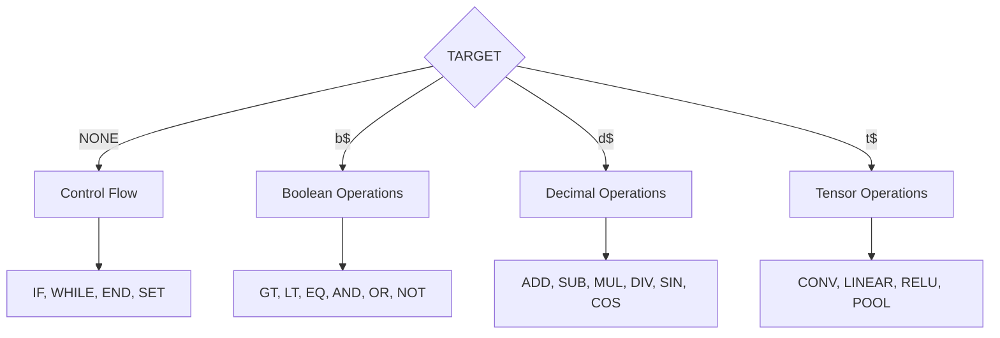

Operations must be declared before use in extensions. For neural networks:

```
[NONE] = DECLARE_OP [CONV] [NONE]            ; Declare CONV exists
[NONE] = OP_PARAM [CHANNELS] [!, d, 32]      ; Set parameter
[NONE] = OP_PARAM [KERNEL] [!, d, 3]         ; Set parameter
[$, t, 1] = CONV [$, t, 0] [NONE]            ; Execute with params
```

Note: `[!, d, 32]` means "inline decimal value 32" where:
- `!` = inline value category
- `d` = decimal type
- `32` = the actual value (from enumerated set or range)

## Inline Values and Enumerations

When a source is category `!` (inline value):

```
[!, TYPE, VALUE_INDEX]
```

VALUE_INDEX selects from context-appropriate options:

For loop counts:
- Enumeration: [0, 1, 2, 3, 5, 10, 20, 50, 100]

For neural channels:
- Enumeration: [1, 4, 8, 16, 32, 64, 128, 256, 512]

For probabilities:
- Enumeration: [0.0, 0.1, 0.25, 0.5, 0.75, 0.9, 1.0]

## Control Flow

### Structured Blocks

Preferred over jumps for genetic stability:

```
[NONE] = IF [$, b, 0] [NONE]
    ; body
[NONE] = END [NONE] [NONE]

[NONE] = WHILE [$, b, 1] [NONE]
    ; body
[NONE] = END [NONE] [NONE]
```

Every IF/WHILE must have matching END. Unclosed blocks are auto-closed before evaluation.

## Variable Allocation

Variables are allocated incrementally:
- First reference to `[$, d, 0]` uses existing d$0
- First reference to `[$, d, 3]` when only 0-2 exist creates d$3
- No explicit allocation instruction needed

## Result Extraction

Programs produce results by:
1. Marking output variables: `[NONE] = RESULT [$, d, 0] [NONE]`
2. Or implicitly using last assigned variable of specified type

The "effective algorithm" is extracted by tracing dependencies backward from result variables, discarding instructions that don't contribute ("junk genome").

## Cascading Validity

At each slot, valid options depend on all previous slots:

```
Slot 0 (TARGET_CAT) determines →
    Slot 1 (TARGET_TYPE) determines →
        Slot 2 (TARGET_INDEX) determines →
            Slot 3 (OPERATION) determines →
                Slot 4-6 (SOURCE1) determines →
                    Slot 7-9 (SOURCE2)
```

This ensures:
- No invalid instructions possible
- Finite options at each step
- Clear choices for Q-learning

## Evolution Considerations

### Avoiding Dispersion

In random evolution, unlimited numeric choices create sparse search. Solutions:
- Use enumerations for common values
- Map Q-learning output [-1,1] to context-appropriate ranges
- Weight common operations higher than rare ones

### Genetic Stability  

Structured blocks (IF/END) are more stable than jumps because:
- Clear scope boundaries
- Easier dependency tracking  
- Natural crossover points

### Operation Probability

Balance operation distribution to avoid:
- Endless arithmetic sequences
- Never discovering control flow
- Infinite scope nesting

Weight operations inversely to their historical frequency in the population.

## Summary

GFSL achieves evolvability through radical constraint:
- Fixed slot structure makes all genomes valid
- Cascading validity makes all mutations safe
- Progressive types add complexity only when needed
- Dynamic operation declaration enables unlimited extension

The language is not for humans to write, but for evolution to discover and Q-learning to guide.

# Depth Specifications

## Part I: Foundational Architecture

### 1. Language Philosophy

GFSL operates as both a programming language and a structural definition language, where every computational concept—from arithmetic operations to neural network architectures—is expressed through uniform six-slot instructions. The language enforces validity through cascading slot dependencies, making invalid programs impossible to construct.

### 1.1 Core Invariants

- **Fixed Width**: Every instruction contains exactly six slots
- **Deterministic Options**: Each slot's valid values are fully determined by previous slots
- **Type Coherence**: Type mismatches are prevented at construction time
- **Progressive Allocation**: Resources (variables, constants) are allocated incrementally
- **Canonical Forms**: Each computational pattern has one unique representation

### 1.2 Instruction Format

```
[[TARGET_CATEGORY | TARGET_TYPE | TARGET_VALUE] | [OPERATION] | [SOURCE1] | [SOURCE2]]
```

In total, considering the fixed structure TARGET_POINTER = OPERATION (POINTER1, POINTER2) we obtain an instruction with 10 numeric slots, of which the operation is always at the 4° absolute index.

Operation is normaly representable just with an integer field, with a normal fixed operations enumerator, but in case you want to support calling recursive genome "functions" or "snippets" in the evolutionary course, splitting it into two values ​​makes it more distinguishable when referring to a fixed operation in the "physics" of the genome versus a genome reference as a function defined at runtime.

Each slot can be represented as a numeric value, usually an integer as an index. Given this fixed structure, it conceptually fits together in the same context—for example, category and type can be grouped together—but this reduces the understanding of a potential q-learning model.

## Part II: Slot Dependency Cascade

### 2. Slot 0: TARGET_CATEGORY

The root of all decisions. Determines if the instruction assigns a value.

**Available Options:**
- `NONE` - No value assignment (used for first slot control flow operationsn, scope management, and configuration)
- `$` - Variable assignment (mutable storage)
- `#` - Constant definition (immutable within scope)
- `!` - Arbitrary value

The first instruction's slot, always referring to an assignment, can only be NONE or $ (variable).

### 2.1 Slot 1: TARGET_SPECIFIER

Specifies the type and index of the target. Its options depend on Slot 0. For example, if Slot 0 is `$`, this slot will present options for variable types (`d` for decimal, `t` for tensor, etc.) followed by their indices. Selecting a new index allocates a new variable.

When dealing with enumerators where the value NONE (or NONE) is available, this is set as index 0.

**When TARGET_CATEGORY = NONE:**
- Options: `[NONE]`
- Purpose: Placeholder for control operations

**When TARGET_CATEGORY = $:**
- Options: `[b, d, t, p, q, ...]` (type indicators)
- Then: `[0, 1, ..., n, n+1]` where n = current count of that type
- Selecting n+1 allocates a new variable

**When TARGET_CATEGORY = #:**
- Options: `[b, d]` (only primitive constants)
- Then: `[0, 1, ..., m, m+1]` where m = current constant count

### 2.1 Slot 2: TARGET_INDEX

As mentioned, the third index in this context is related precisely to the index of the constant/variable in question.

So, for example, #d1 => [#, d, 1] => the decimal costant at index 1

In this document, a pointer could be indicated as d#1 for readibility, but for a genetic point of view, has more sense put the pointer's category as first slot, with NONE option for not-returning operations (and blocks).

### 2.2 Slot 2: OPERATION

The operation to perform, strictly constrained by target type.

**When TARGET = NONE:**
- `CALL` - Function invocation
- `RET` - Return from function (better implicit solutions like "last variable assigned value")
- `BEGIN` - Start declaration block
- `SET` - Set property in declaration
- `EXEC` - Execute declared block
- `END` - End current scope (see Section 5.5)
- `RESULT` - Mark variable as output (see Section 5.6)

RESULT is not mandatory: the last variable of the desired type or the first/last assigned variable can be used as the result.

END: This can be considered implicit at the point where the algorithm "takes" its cue.

RESULT and END clearly demonstrate how a genetic algorithm/definition can work "where it's at" based on certain executing-script reference points. At the same time, based on the variable(s) taken as the result's reference, it is necessary to calculate which instructions and pointers interact effectively with the final results, allowing the "junk genome" to be discarded and obtaining its effective algorithm (with a precise hash).

---

**POSSIBLE BRANCH OPERATION:**
- `JMP` - Unconditional jump
- `JZ` - Jump if zero/false
- `JNZ` - Jump if non-zero/true

I don't recommend them, because not coherent with genoma linearity.

---

**When TARGET = b$ or b#:**
- Comparisons: `GT, LT, EQ, GTE, LTE, NEQ`
- Logic: `AND, OR, XOR, NOT, IMP`
- Type checks: `IS_ZERO, IS_POS, IS_NEG`

**When TARGET = d$ or d#:**
- Arithmetic: `ADD, SUB, MUL, DIV, MOD`
- Algebraic: `POW, ROOT, ABS, NEG`
- Transcendental: `SIN, COS, TAN, EXP, LOG`
- Aggregation: `MIN, MAX, AVG`

**When TARGET = t$:**
- Layer operations: `CONV, LINEAR, POOL, NORM`
- Activation: `RELU, SIGMOID, TANH, SOFTMAX`
- Structure: `RESHAPE, CONCAT, SPLIT, PAD`
- Combination: `ADD_T, MUL_T, RESIDUAL`

### 2.3 Slot 3: SOURCE1_CATEGORY

Category of the first operand, determined by the `OPERATION`. Options can include `$` (variable), `#` (constant), `NUM` (inline number), `LABEL`, or `ENUM` (property).

**Operation-Specific Constraints:**

For arithmetic operations (ADD, MUL, etc.):
- Options: `[$, #, NUM]`
- Purpose: Allow variables, constants, or inline numbers

For comparisons (GT, LT, etc.):
- Options: `[$, #, NUM]`
- Must be decimal-typed

For boolean operations (AND, OR, etc.):
- Options: `[$, #]`
- Must be boolean-typed

For tensor operations (CONV, etc.):
- Options: `[$]`
- Must be tensor-typed

For control flow (JZ, JNZ):
- Options: `[$, #]` for condition
- Options: `[LABEL]` for target

For property setting (SET):
- Options: `[ENUM]`
- Then enumerate valid properties

For scope termination (END):
- Options: `[SCOPE_TYPE]`
- Then: `[BLOCK, IF, WHILE, FOR, FUNC, LAYER, ALL]`

### 2.4 Slot 4: SOURCE1_SPECIFIER

Identifies the specific source based on the category chosen in Slot 3. For example, if `ENUM` is chosen for a `SET` operation, this slot lists the available properties to configure (e.g., `CHANNELS`, `KERNEL`).

**When SOURCE1_CATEGORY = $:**
- First: Type selection `[b, d, t, ...]`
- Then: Index `[0, ..., k-1]` where k = count of that type

**When SOURCE1_CATEGORY = #:**
- First: Type selection `[b, d]`
- Then: Index `[0, ..., j-1]` where j = constant count

**When SOURCE1_CATEGORY = NUM:**
- Options depend on numeric value strategy (see section 3)

**When SOURCE1_CATEGORY = ENUM:**
- For CONV: `[CHANNELS, KERNEL, STRIDE, PADDING, DILATION, GROUPS]`
- For LINEAR: `[UNITS, BIAS, INIT]`
- For POOL: `[TYPE, SIZE, STRIDE]`
- For NORM: `[EPSILON, MOMENTUM, AFFINE]`

**When SOURCE1_CATEGORY = LABEL:**
- Reference to defined label in program

**When OPERATION = END and SOURCE1_CATEGORY = SCOPE_TYPE:**
- Options depend on current open scopes
- Only scope types with open blocks are valid
- Special value `ALL` always available if depth > 0

### 2.5 Slot 5: SOURCE2_SPECIFIER

The second operand. Its availability and options depend on the arity of the `OPERATION`. For binary operations, it specifies the second source. For unary or configuration operations, it is often `NONE`.

**For binary operations:**
- Same cascade as SOURCE1 but without category selection
- Type must match operation requirements

**For unary operations:**
- Options: `[NONE]`

**For parameterized operations:**
- Additional parameter value or reference

In the case of source values, it is possible to specify, if advantageous to the context and not dispersive, integer and/or float values ​​from -1/0 to 1. It depends both on how pragmatic it is to the result you are aiming for, on the applicability in the case of completely random evolution and on practicality in the case of semi-supervised q-learning.

## Part III: Numeric Value Strategies

### 3. Dynamic Numeric Management

The language provides multiple strategies for numeric values, selectable based on evolution context.

### 3.1 Strategy Arbitrary Values Enumeration

These are references for handling arbitrary values ​​in an implementation based on purpose and context.

**ENUM_INT: Enumerated Integers**
- Small integers for loop counts, array indices
- Options: `[0, 1, 2, 3, 4, 5, 8, 10, 16, 32, 64, 128, 256, 512, 1024]`
- Rationale: Powers of 2 common in computing, small numbers for control

**ENUM_PROB: Probability Values**
- For probabilistic operations, dropout rates
- Options: `[0.0, 0.1, 0.2, 0.25, 0.3, 0.4, 0.5, 0.6, 0.7, 0.75, 0.8, 0.9, 1.0]`
- Rationale: Common probability thresholds and quartiles

**ENUM_SCALE: Scaling Factors**
- For mathematical scaling, learning rates
- Options: `[0.001, 0.01, 0.1, 0.5, 1.0, 2.0, 10.0, 100.0]`
- Rationale: Logarithmic scale for wide range coverage

**RATIO: Evolutionary Ratio**
- Single value in [0, 1] that evolution/Q-learning adjusts
- Interpretation context-dependent:
  - Neural: `floor(ratio * 2048)` for layer sizes
  - Probability: Direct use as probability
  - Mathematical: `exp(ratio * 10 - 5)` for wide range

**FRACTION: Rational Construction**
- Build through division of integers
- Example: 1/3 via `DIV(1, 3)`

**LEARNED: Evolution-Discovered Values**
- Values that evolve separately from structure
- Tracked and optimized by genetic algorithm
- Q-learning provides initial estimates

### 3.2 Context-Adaptive Selection

The numeric strategy adapts based on operation context:

- **After CHANNELS declaration**: ENUM_INT with neural-appropriate values
- **After learning rate operations**: ENUM_SCALE
- **After probability operations**: ENUM_PROB
- **Default mathematical**: RATIO or FRACTION

## Part IV: Extended Type System

### 4. Boolean Operations

Boolean type enables algorithmic control and decision-making.

### 4.1 Boolean Constants

**Predefined boolean constants:**
- `b#0` = FALSE
- `b#1` = TRUE

### 4.2 Comparison Operations

All comparisons produce boolean results from decimal inputs:
- `GT(d1, d2) → b`: Greater than
- `LT(d1, d2) → b`: Less than  
- `EQ(d1, d2) → b`: Equality (with epsilon tolerance)
- `GTE(d1, d2) → b`: Greater or equal
- `LTE(d1, d2) → b`: Less or equal
- `NEQ(d1, d2) → b`: Not equal

### 4.3 Logical Operations

Boolean algebra operations:
- `AND(b1, b2) → b`: Conjunction
- `OR(b1, b2) → b`: Disjunction
- `XOR(b1, b2) → b`: Exclusive or
- `NOT(b1) → b`: Negation
- `IMP(b1, b2) → b`: Implication (¬b1 ∨ b2)

## Part V: Control Flow Mechanisms

### 5. Jump-Based Control

Assembly-style control using labels and conditional jumps.

### 5.1 LABEL-JUMP System

**I don't recommend the label-jump system, preferring the more coherent "block" approach (IF-WHILE..)**

Labels mark positions in instruction sequence:
- Format: `L[0-9]+` or semantic names
- Scope: Function-local or global
- Resolution: Forward and backward references

#### Jump Instructions

**Unconditional:**
- `JMP label`: Continue execution at label

**Conditional:**
- `JZ label condition`: Jump if condition is zero/false
- `JNZ label condition`: Jump if condition is non-zero/true

A genoma systme supporting "functions" is possible, and implicit in the user's definition of custom (but fixed) operations. In the facts, a script can combine a series of recursive and functional instructions with an additional operation. From a structural perspective, this is the case in which the operation definition should be divided into different units, such as 2, to clearly distinguish when a structural operation is invoked based on the "context physics" versus a dynamic operation (or function). It's also worth remembering that a function may require different ways to assimilate complex arguments, beyond the default maximum of "2 input arguments," as similarly happens with the example extension for defining PyTorch model layers.

### 5.2 Loop Pattern Example

```
Computing factorial:
b$0 = SET(d!1)
WHILE b$0:
  d$1 = MUL(d$1, d$0)       ; result *= n
  d$0 = SUB(d$0, d#1)       ; n -= 1
  b$0 = GT(d$0, d#1)
  END
```

### 5.3 Block-Structured Control 

Stack-based structured control for environments preferring nested scopes:

**IF-ELSE-END:**
- Pushes new variable scope
- Condition evaluated once
- Single branch executed

It's not alwyas useful and equilibrated using ELSEs, simply rely on the NOT of a boolean variable and its subsequent IF.

**WHILE-END:**
- Pushes new variable scope
- Condition evaluated each iteration
- Body repeats until false

**FOR-END:**
- Pushes new variable scope with iterator
- Fixed iteration count
- Iterator accessible in body

### 5.4 Scope Termination with END

The END operation explicitly closes open scopes and maintains structural balance:

```
[[NONE], END, [NONE], [NONE]]
```

All scopes must be explicitly closed at the point you take the code.

**SCOPE_TYPE options:**
- `BLOCK` - Generic block termination
- `IF` - Closes IF conditional
- `WHILE` - Closes WHILE loop
- `FOR` - Closes FOR loop
- `FUNC` - Function termination
- `ALL` - Emergency cascade-close all open scopes

**BLOCK_ID validation:**
- Must match the most recent unclosed scope of SCOPE_TYPE
- Mismatched IDs become NOP operations
- NONE accepts any scope of the type

**Scope depth tracking:**
- Each BEGIN/IF/WHILE increments depth
- Each valid END decrements depth
- Maximum depth is implementation-defined (suggested: 8)

To prevent infinite loops or invalid states from unclosed scopes, a post-processing step before fitness evaluation will automatically append the necessary `[[NONE], END, ALL, [NONE]]` instruction if the program terminates with open scopes. This ensures structural validity without penalizing an otherwise viable genome for a trivial termination error.

### 5.5 Result Extraction

Programs declare their outputs explicitly:

```
[[NONE], RESULT, $, VAR_TYPE_AND_INDEX, PRIORITY]
```

**VAR_TYPE:** Type of result variable (`b`, `d`, `t`)
**VAR_ID:** Index of the variable
**PRIORITY:** 0 = primary result, 1+ = secondary results

Results are extracted when:
1. A RESULT instruction is executed
2. Program reaches natural termination
3. All scopes are closed after RESULT declaration

The "real algorithm" consists of all instructions that contribute to RESULT variables through dependency analysis.

### 5.6. Result Extraction

The `RESULT` instruction provides optionally a clear and explicit mechanism for designating program outputs.

*   **Function**: Marks a specific variable as an output. `PRIORITY` (e.g., a numeric value from 0 upwards to available variables) can be used to distinguish primary from secondary outputs.
*   **Junk Genome Pruning**: The "effective algorithm" is determined via dependency analysis, tracing backward from all variables marked with `RESULT`. Any instructions not contributing to these final results are considered part of the "junk genome" and can be ignored during execution analysis, though they remain part of the genetic material for future mutations.


## Part VI: Neural Architecture Extension

### 6. Tensor Operations and Layer Definitions

Neural networks are expressed through tensor operations and parameterized layer declarations.

### 6.1 Tensor Type

Tensors represent n-dimensional arrays:
- `t$n`: Tensor variable n
- Shape tracked implicitly through operations
- Automatic shape inference and validation

### 6.2 Layer Declaration Pattern

Layers use declaration-configuration-execution pattern:

```
DECLARE → CONFIGURE* → EXECUTE
```

1. **DECLARE**: Create layer template with target tensor
2. **CONFIGURE**: Set layer parameters (0 or more)
3. **EXECUTE**: Apply configured layer to input

Wach layer creation is a **single, atomic instruction** that both defines and executes the operation, returning an output tensor. Configuration is handled via subsequent, optional `SET` instructions that modify the *next* layer to be created.

### 6.2.1. The `SET` Instruction

The `SET` instruction now functions as a configuration modifier for the *subsequent* layer operation.

*   **Format**: `[[NONE], SET, [CATEGORY, PROPERTY, VALUE], [NONE]]`
*   **Example**: `[[NONE], SET, CHANNELS, 64, [NONE..]]`
*   **Behavior**: The interpreter maintains a "configuration context". When a `SET` instruction is executed, it adds or modifies a parameter in this context (e.g., `{CHANNELS: 64}`). When a tensor operation like `CONV` is executed, it consumes the parameters from the current context and then clears it. If a parameter is not in the context, a default value is used.

This approach allows evolution to either specify parameters explicitly or let the system use defaults, providing flexibility.

### 6.3 Layer Operation Enumeration

**Convolutional Layers:**
- `CONV`: 2D convolution
  - Properties: CHANNELS, KERNEL, STRIDE, PADDING, DILATION, GROUPS
- `CONV1D`: 1D convolution
  - Properties: CHANNELS, KERNEL, STRIDE, PADDING
- `CONV3D`: 3D convolution
  - Properties: CHANNELS, KERNEL, STRIDE, PADDING
- `DECONV`: Transposed convolution
  - Properties: CHANNELS, KERNEL, STRIDE, PADDING, OUTPUT_PADDING

**Linear Layers:**
- `LINEAR`: Fully connected
  - Properties: UNITS, BIAS, INIT
- `EMBEDDING`: Embedding lookup
  - Properties: NUM_EMBEDDINGS, EMBEDDING_DIM

**Pooling Layers:**
- `POOL`: Generic pooling
  - Properties: TYPE(MAX/AVG), SIZE, STRIDE
- `ADAPTIVE_POOL`: Output-size based pooling
  - Properties: OUTPUT_SIZE

**Normalization:**
- `NORM`: Batch normalization
  - Properties: EPSILON, MOMENTUM, AFFINE
- `LAYER_NORM`: Layer normalization
  - Properties: NORMALIZED_SHAPE, EPSILON
- `INSTANCE_NORM`: Instance normalization

**Activation Functions:**
- `RELU`, `LEAKY_RELU`, `ELU`, `SELU`
- `SIGMOID`, `TANH`, `SOFTMAX`
- `GELU`, `SWISH`, `MISH`

**Structural Operations:**
- `RESHAPE`: Change tensor dimensions
- `CONCAT`: Concatenate tensors
- `SPLIT`: Split tensor
- `PAD`: Add padding

**Attention Mechanisms:**
- `ATTENTION`: Self-attention
  - Properties: HEADS, DIM, DROPOUT
- `CROSS_ATTENTION`: Cross-attention
  - Properties: HEADS, DIM, DROPOUT

## Part VI: Neural Architecture Operations

### Layer Creation Pattern

Layers are configured then created atomically:

```
; Configure next layer
[NONE, NONE, NONE, SET, CHANNELS, 64]
[NONE, NONE, NONE, SET, KERNEL, 3]

; Create and execute layer
[t$, 1, NEW_ID, CONV, t$0, NONE]        ; t$1 = Conv(t$0) with config
```

### Available Layer Types

**Convolution**: `CONV`, `CONV1D`, `CONV3D`
- Properties: CHANNELS, KERNEL, STRIDE, PADDING

**Linear**: `LINEAR`, `EMBEDDING`
- Properties: UNITS, BIAS

**Pooling**: `POOL`, `ADAPTIVE_POOL`
- Properties: TYPE (MAX/AVG), SIZE

**Normalization**: `NORM`, `LAYER_NORM`
- Properties: EPSILON, MOMENTUM

**Activation**: `RELU`, `SIGMOID`, `TANH`, `SOFTMAX`
- No configuration needed

### 6.4 Layer Definition Pattern Example
```
// Set desired configuration for the NEXT operation
[[NONE], SET, CHANNELS, 64, [NONE..]]
[[NONE], SET, KERNEL, 3, [NONE..]]

// Atomically create and execute the layer
// The CONV operation uses and clears the context set above
[[t, $, 1], CONV, $, [t$0], [NONE]]
```
In this example, the `CONV` instruction on `t$1` implicitly uses `t$0` as input, applies the configured properties (64 channels, kernel size 3), executes the convolution, and assigns the resulting output tensor to `t$1`. The operation is a single, cohesive unit.

### Marking Outputs

```
[NONE, RESULT, b$2, [NUM, d, 0]]      ; Mark b$2 as primary output
```

### Effective Algorithm Extraction

The system traces dependencies backward from RESULT variables:
1. Identify all RESULT instructions
2. Trace dependencies of marked variables
3. Include only contributing instructions
4. Discard "junk genome"

## Part VII: Extension Framework

### 7. Domain Extension Principles

New domains extend the language without modifying core mechanics.

### 7.1 Extension Components

**Type Registration:**
- New type prefix (e.g., `q` for quantum, `c` for complex)
- Storage semantics (mutable/immutable)
- Default initialization

**Operation Registration:**
- Operation names (prefixed to avoid collision)
- Type signatures (input → output)
- Arity and parameter requirements

**Option Enumeration:**
- Slot-specific option providers
- Context-aware filtering
- Validation predicates

### 7.2 Extension Example: Complex Numbers

**Type Addition:**
- `$c`: Complex variables
- `#c`: Complex constants

**Operations:**
- `CMPLX(d1, d2) → c`: Create complex from real/imaginary
- `CONJ(c) → c`: Complex conjugate
- `ARG(c) → d`: Argument (angle)
- `MAG(c) → d`: Magnitude
- `RE(c) → d`: Real part
- `IM(c) → d`: Imaginary part

**Numeric Options:**
- Common complex values: `i, -i, 1+i, 1-i`
- Polar form construction via `CMPLX_POLAR(mag, angle)`

### 7.3 Extension Example: Probabilistic Programming

**Type Addition:**
- `$dist`: Distribution variables
- `$sample`: Sample collections

**Operations:**
- `NORMAL(mean, std) → dist`: Create normal distribution
- `UNIFORM(low, high) → dist`: Create uniform distribution
- `SAMPLE(dist, count) → sample`: Draw samples
- `EXPECT(sample) → d`: Expected value
- `VAR(sample) → d`: Variance

**Integration:**
- Distributions can parameterize neural layers
- Samples can initialize weights
- Expectations can define loss functions

## Part VIII: Evolution Mechanics

### 8. Genetic Operations

Evolution operates on instruction sequences while preserving validity.

### 8.1 Mutation Classes

**Slot Mutation:**
- Select random slot in random instruction
- Choose new value from valid options
- Cascade updates to dependent slots

**Instruction Mutation:**
- Replace entire instruction
- Maintain type consistency with context

**Block Mutation:**
- Modify control flow blocks
- Preserve scope balance

**Numeric Mutation:**
- For RATIO strategy: Gaussian perturbation
- For ENUM strategy: Adjacent value selection
- For LEARNED: Separate evolution track

### 8.2 Crossover Mechanisms

**Aligned Crossover:**
- Find positions with compatible variable states
- Exchange instruction subsequences
- Validate result

**Block Crossover:**
- Exchange complete control blocks
- Maintain structural integrity

**Layer Crossover:**
- Exchange neural architecture segments
- Preserve tensor shape compatibility

### 8.3 Validity Preservation

All genetic operations maintain these invariants:
- Variables referenced before allocation
- Type consistency across operations
- Control flow balance (jumps to valid labels)
- Tensor shape compatibility

## Part IX: Q-Learning Integration

### 9. State Representation

Q-learning observes genome construction state.

### 9.1 State Features

**Structural Features:**
- Current instruction index
- Current slot index
- Stack depth
- Variables allocated per type
- Recent operations (sliding window)

**Context Features:**
- Last operation type
- Target variable type
- Pending declarations
- Active scopes

**Performance Features:**
- Fitness trajectory
- Recent mutation success rate
- Exploration bonus

### 9.2 Action Space

Actions are slot value selections from enumerated options:
- Action space size = maximum option count
- Invalid actions masked with -∞ Q-values
- Exploration via ε-greedy or softmax

### 9.3 Reward Signals

**Immediate Rewards:**
- Valid instruction completion: +1
- Invalid attempt: -1
- New variable allocation: +0.1
- Reuse of computed value: +0.2

**Episode Rewards:**
- Fitness improvement: Proportional reward
- Novel solution: Exploration bonus
- Efficiency (shorter genome): Length penalty

## Part X: Implementation Considerations

### 10. Efficiency Optimizations

**Option Enumeration Caching:**
- Precompute common option sequences
- Memoize validation results
- Index valid transitions

**Lazy Evaluation:**
- Defer shape inference until needed
- Cache intermediate computations
- Prune unreachable code

**Parallel Evolution:**
- Independent genome evaluation
- Crossover pool sharing
- Distributed fitness computation

### 10.1 Memory Management

**Variable Pooling:**
- Reuse deallocated indices
- Compact sparse allocations
- Limit maximum variables per type

**Instruction Compression:**
- Bit-pack slot values
- Dictionary compression for common patterns
- Delta encoding for similar genomes

### 10.2 Debugging Support

**Trace Generation:**
- Step-by-step execution logs
- Variable state snapshots
- Shape inference traces

**Validation Reporting:**
- Detailed error messages
- Suggestion for fixes
- Nearest valid alternatives

### 10.3 Scope Balance Enforcement

**Automatic repair for unclosed scopes:**
- Genomes with unclosed scopes get automatic END injection
- Repair happens before fitness evaluation
- Original genome preserved for evolution

**Statistical biasing against scope imbalance:**
- Mutation probability for BEGIN: `p * (0.9^depth)`
- Mutation probability for END: `p * (1.1^depth)`
- At maximum depth, only END or neutral operations allowed

### Effective Algorithm Extraction and Practices

The system traces dependencies backward from RESULT variables:
1. Identify all RESULT instructions
2. Trace dependencies of marked variables
3. Include only contributing instructions
4. Discard "junk genome"

The fact remains that these are proofs, and an effective implementation requires both statistical balance in the possible combinations and practicality of interaction with the q-learning model, if present.

Since each slot has specific options available based on the previous slots, the same applies to the specific definition of parameters: if they are mandatory, then they must be the only option, or available immediately after the definition of the object to which they relate or one of their parameters. The order in which the types (attributes) are defined helps limit redundancies between algorithms with different hashes but the same result.

## Part XII: Language Properties

### 12.1 Completeness

GFSL is Turing-complete through:
- Arbitrary memory via variables
- Conditional execution via jumps
- Iteration via loops
- Function composition via CALL/RET

### 12.2 Determinism

Given a genome and input, execution is deterministic:
- No random operations in base language
- Floating-point operations use IEEE-754
- Evaluation order is fixed

### 12.3 Composability

Programs can be composed:
- Functions via CALL/RET
- Modules via namespace prefixes
- Layers via declaration blocks
- Genomes via concatenation

### 12.4 Evolvability

The language optimizes for evolution:
- Local changes have local effects
- Invalid states are unreachable
- Neutral mutations are possible
- Complexity emerges gradually

# GFSL Specification for Description

This version of the specification aims to highlight the descriptive side of the genetic instruction structure, beyond the basic mathematical and algorithmic aspects. It tends to present some concepts in different schemes.

## Core Concept

GFSL is a fixed-structure language where every instruction is 10 integer slots. Each integer is either:
- An index into an enumerated list of options
- An index of a variable/constant  
- An arbitrary value from a context-specific range (rare)

The key: **the meaning of each slot is determined entirely by previous slots**.

## Instruction Structure

```
[TARGET_CAT | TARGET_TYPE | TARGET_INDEX | OPERATION | SOURCE1_CAT | SOURCE1_TYPE | SOURCE1_VALUE | SOURCE2_CAT | SOURCE2_TYPE | SOURCE2_VALUE]
```

Every instruction represents: `TARGET = OPERATION(SOURCE1, SOURCE2)`

## Slot Cascades

### Slot 0: Target Category

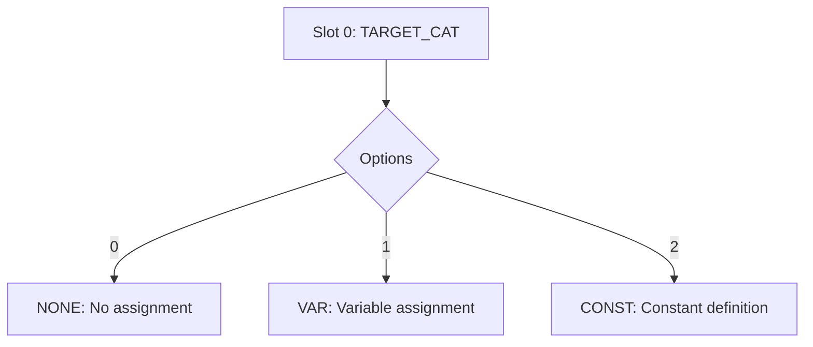

### Slot 1: Target Type

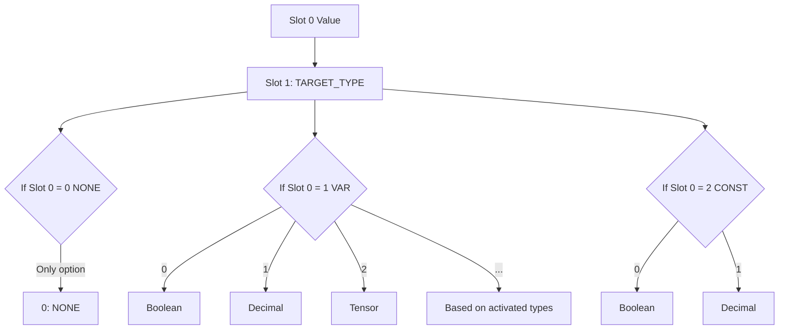

### Slot 2: Target Index

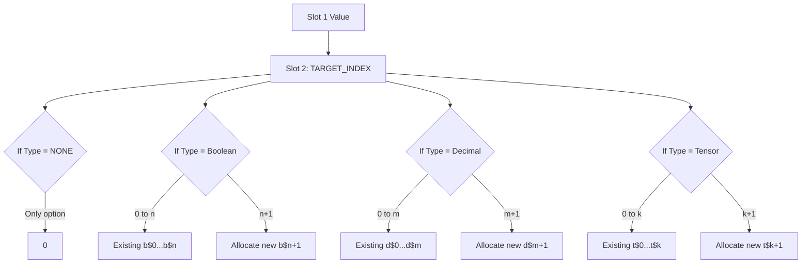

### Slot 3: Operation

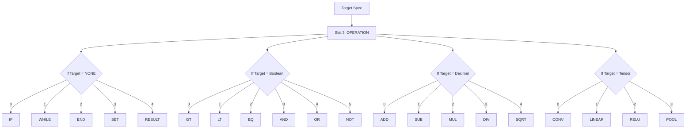

### Slots 4-6: Source1 Cascade

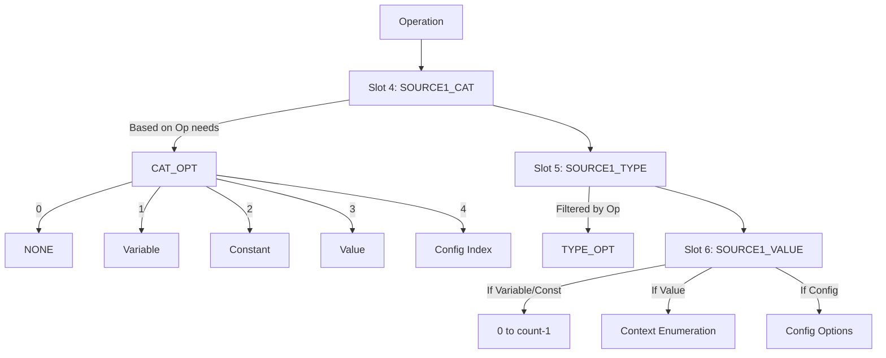

## Category Definitions

| Index | Category | Symbol | Purpose |
|-------|----------|--------|---------|
| 0 | NONE | - | No data |
| 1 | VARIABLE | $ | Mutable storage |
| 2 | CONSTANT | # | Immutable value |
| 3 | VALUE | ! | From enumeration |
| 4 | CONFIG | & | Configuration index |

## Context-Dependent Value Enumerations

When SOURCE_CAT = VALUE, the SOURCE_VALUE slot selects from an enumeration determined by the operation context:

### Operation Context Determines Enumeration

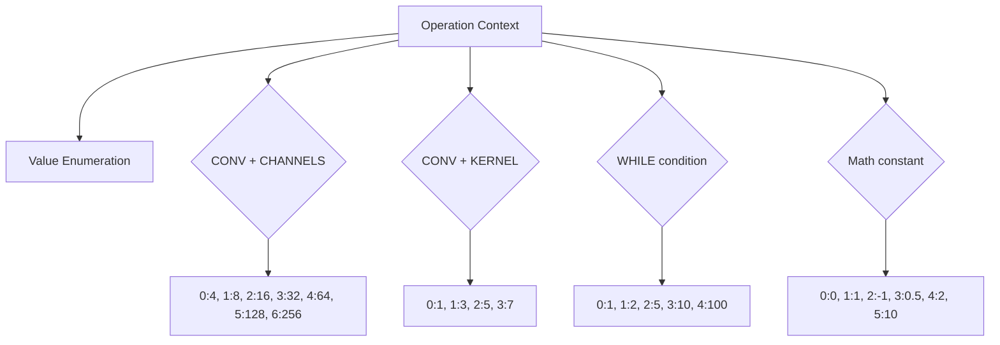

## Configuration Without Names

Instead of named properties, configurations use indexed parameters:

### Neural Layer Configuration

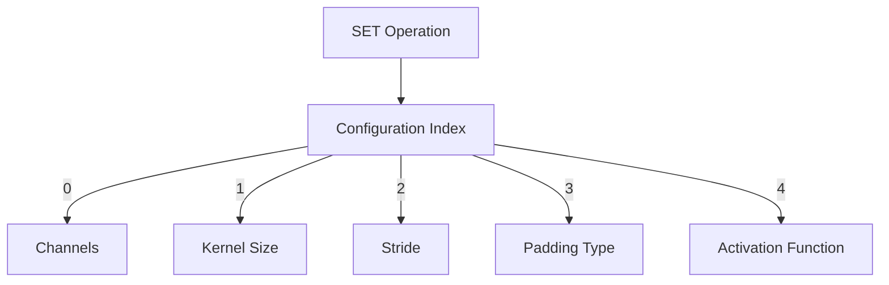

**Example:** Configure and execute convolution
```
[0,0,0, 3, 4,0,0, 3,1,32]  // SET config[0]=32 (channels from value enum)
[0,0,0, 3, 4,1,0, 3,1,2]   // SET config[1]=2 (kernel from value enum)  
[1,2,1, 0, 1,2,0, 0,0,0]   // t$1 = CONV(t$0)
```

Where:
- Config index 0 = channels parameter
- Config index 1 = kernel parameter
- Value enumerations are context-specific

## Progressive Type Activation

Types are activated based on the problem domain:

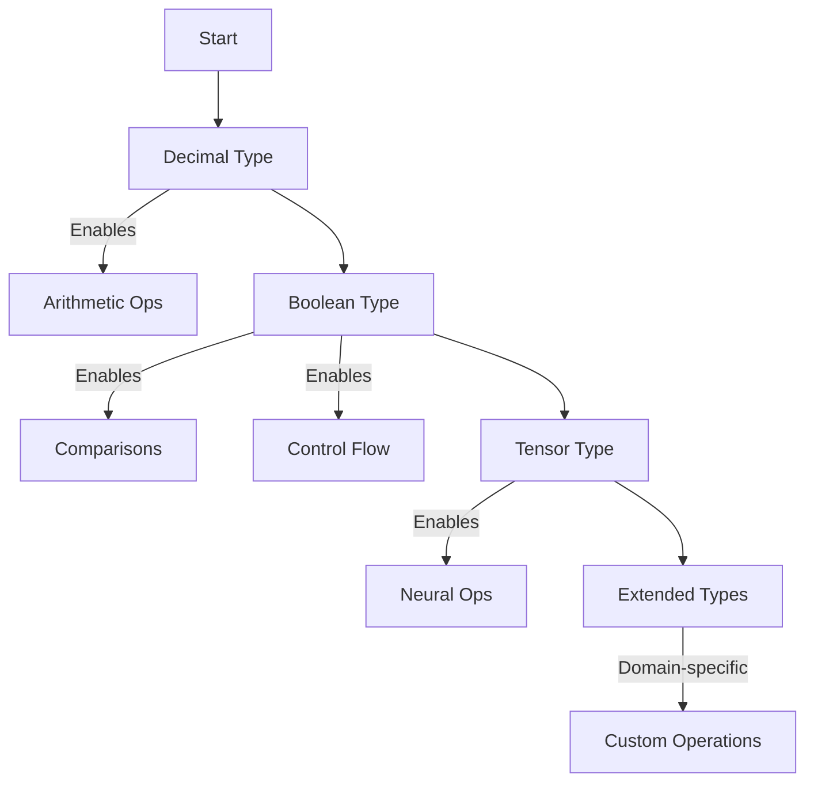

## Value Selection Strategies

The system must know when a slot expects:
1. **An enumeration index** - selecting from a finite list
2. **An arbitrary value** - a computed number

### Strategy 1: Pure Enumeration
Every VALUE slot selects from context-specific enumerations:
- Simple for evolution
- Finite search space
- May miss precise values

### Strategy 2: Q-Learning Mapping
Q-learning outputs [-1, 1], mapped to context:
- For enumerations: `index = floor((output + 1) * len(enum) / 2)`
- For ranges: `value = min + (output + 1) * (max - min) / 2`
- Smooth value adjustments

### Strategy 3: Dual-Mode
Some contexts use enumerations, others use ranges:
- Channels: enumeration [4, 8, 16, 32, ...]
- Learning rate: continuous [0.0001, 1.0]
- System tracks which mode per context

## Control Flow Without Labels

### Block Structure Cascades

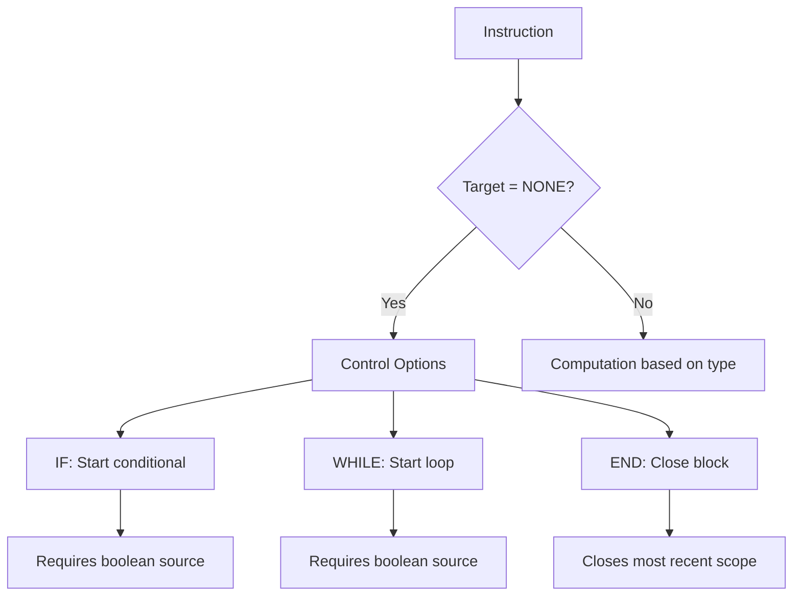

### Example: Factorial

```
// Input: d$0 = n, Output: d$1 = n!

[1,1,1, 0, 3,1,0, 0,0,0]   // d$1 = 1 (value enum: index 0 = 1)
[1,0,0, 0, 1,1,0, 3,1,0]   // b$0 = GT(d$0, 1)

[0,0,0, 1, 1,0,0, 0,0,0]   // WHILE b$0
  [1,1,1, 2, 1,1,1, 1,1,0] //   d$1 = MUL(d$1, d$0)
  [1,1,0, 1, 1,1,0, 3,1,0] //   d$0 = SUB(d$0, 1)
  [1,0,0, 0, 1,1,0, 3,1,0] //   b$0 = GT(d$0, 1)
[0,0,0, 2, 0,0,0, 0,0,0]   // END

[0,0,0, 4, 1,1,1, 0,0,0]   // RESULT d$1
```

## Genetic Operation Validity

### Mutation Cascades

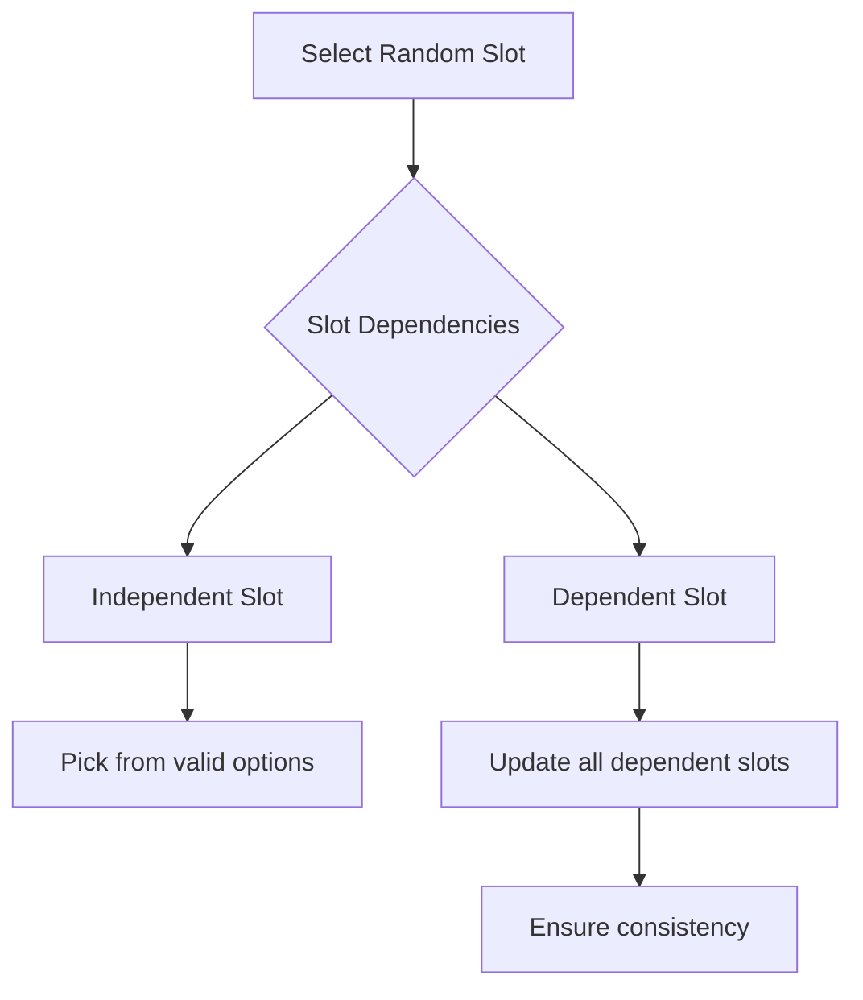

### Crossover Points

Valid crossover only at:
- Instruction boundaries
- Block boundaries (IF/WHILE...END)
- After scope depth returns to baseline

## Implementation Decisions

### What the System Must Track

1. **Variable counts by type** - How many b$, d$, t$ exist
2. **Current scope depth** - For nested blocks
3. **Configuration state** - What SET operations are pending
4. **Operation availability** - Which ops are activated
5. **Context mode** - Enumeration vs range for values

### What Evolution Must Know

1. **Valid options per slot** - Never generate invalid indices
2. **Value context** - When selecting VALUE category
3. **Scope balance** - END operations must match opens
4. **Type consistency** - Can't mix incompatible types

## Summary

GFSL achieves evolutionary efficiency through:
- Every slot value is an index (except rare arbitrary values)
- Options cascade from previous slots
- No names, only indices
- Context determines value enumerations
- Blocks provide structure without fragile references

The language grows from basic arithmetic to neural networks using the same 10-slot format, with each domain activating only the types and operations it needs. Evolution explores a dense space of valid programs, guided by contextual constraints that channel search toward useful solutions.

## Instruction Structure

```
[TARGET_CAT | TARGET_TYPE | TARGET_INDEX | OPERATION | SOURCE1_CAT | SOURCE1_TYPE | SOURCE1_VALUE | SOURCE2_CAT | SOURCE2_TYPE | SOURCE2_VALUE]
```

Every instruction represents: `TARGET = OPERATION(SOURCE1, SOURCE2)`

## Slot Cascades

### Slot 0: Target Category


### Slot 1: Target Type


### Slot 2: Target Index


### Slot 3: Operation


### Slots 4-6: Source1 Cascade


## Category Definitions

| Index | Category | Symbol | Purpose |
|-------|----------|--------|---------|
| 0 | NONE | - | No data |
| 1 | VARIABLE | $ | Mutable storage |
| 2 | CONSTANT | # | Immutable value |
| 3 | VALUE | ! | From enumeration |
| 4 | CONFIG | & | Configuration index |

## Context-Dependent Value Enumerations

When SOURCE_CAT = VALUE, the SOURCE_VALUE slot selects from an enumeration determined by the operation context:

### Operation Context Determines Enumeration


## Configuration Without Names

Instead of named properties, configurations use indexed parameters:

### Neural Layer Configuration


**Example:** Configure and execute convolution
```
[0,0,0, 3, 4,0,0, 3,1,32]  // SET config[0]=32 (channels from value enum)
[0,0,0, 3, 4,1,0, 3,1,2]   // SET config[1]=2 (kernel from value enum)  
[1,2,1, 0, 1,2,0, 0,0,0]   // t$1 = CONV(t$0)
```

Where:
- Config index 0 = channels parameter
- Config index 1 = kernel parameter
- Value enumerations are context-specific

## Progressive Type Activation

Types are activated based on the problem domain:


## Value Selection Strategies

The system must know when a slot expects:
1. **An enumeration index** - selecting from a finite list
2. **An arbitrary value** - a computed number

### Strategy 1: Pure Enumeration
Every VALUE slot selects from context-specific enumerations:
- Simple for evolution
- Finite search space
- May miss precise values

### Strategy 2: Q-Learning Mapping
Q-learning outputs [-1, 1], mapped to context:
- For enumerations: `index = floor((output + 1) * len(enum) / 2)`
- For ranges: `value = min + (output + 1) * (max - min) / 2`
- Smooth value adjustments

### Strategy 3: Dual-Mode
Some contexts use enumerations, others use ranges:
- Channels: enumeration [4, 8, 16, 32, ...]
- Learning rate: continuous [0.0001, 1.0]
- System tracks which mode per context

## Control Flow Without Labels

### Block Structure Cascades


### Example: Factorial

```
// Input: d$0 = n, Output: d$1 = n!

[1,1,1, 0, 3,1,0, 0,0,0]   // d$1 = 1 (value enum: index 0 = 1)
[1,0,0, 0, 1,1,0, 3,1,0]   // b$0 = GT(d$0, 1)

[0,0,0, 1, 1,0,0, 0,0,0]   // WHILE b$0
  [1,1,1, 2, 1,1,1, 1,1,0] //   d$1 = MUL(d$1, d$0)
  [1,1,0, 1, 1,1,0, 3,1,0] //   d$0 = SUB(d$0, 1)
  [1,0,0, 0, 1,1,0, 3,1,0] //   b$0 = GT(d$0, 1)
[0,0,0, 2, 0,0,0, 0,0,0]   // END

[0,0,0, 4, 1,1,1, 0,0,0]   // RESULT d$1
```

## Genetic Operation Validity

### Mutation Cascades

```mermaid
graph TD
    MUT[Select Random Slot] --> CHECK{Slot Dependencies}
    
    CHECK --> INDEP[Independent Slot]
    INDEP --> SIMPLE[Pick from valid options]
    
    CHECK --> DEP[Dependent Slot]
    DEP --> CASCADE[Update all dependent slots]
    CASCADE --> REVALIDATE[Ensure consistency]
```

### Crossover Points

Valid crossover only at:
- Instruction boundaries
- Block boundaries (IF/WHILE...END)
- After scope depth returns to baseline

## Implementation Decisions

### What the System Must Track

1. **Variable counts by type** - How many b$, d$, t$ exist
2. **Current scope depth** - For nested blocks
3. **Configuration state** - What SET operations are pending
4. **Operation availability** - Which ops are activated
5. **Context mode** - Enumeration vs range for values

### What Evolution Must Know

1. **Valid options per slot** - Never generate invalid indices
2. **Value context** - When selecting VALUE category
3. **Scope balance** - END operations must match opens
4. **Type consistency** - Can't mix incompatible types

## Summary

GFSL achieves evolutionary efficiency through:
- Every slot value is an index (except rare arbitrary values)
- Options cascade from previous slots
- No names, only indices
- Context determines value enumerations
- Blocks provide structure without fragile references

The language grows from basic arithmetic to neural networks using the same 10-slot format, with each domain activating only the types and operations it needs. Evolution explores a dense space of valid programs, guided by contextual constraints that channel search toward useful solutions.
## Conclusion

The Genetic Fixed Structure Language provides a universal substrate for evolving computational structures. Its fixed instruction format and cascading validity system create a search space where every point is a valid program, while the enumeration-based option system provides finite, discrete choices at each decision point. This design enables both random exploration and guided search to efficiently discover solutions across domains from arithmetic to neural architecture.

---

## Next steps
- Fix ambiguities
- Create better conditional graphs about available field option combinations and their sequential activation and extensions implementation (decimal => boolean => branches => ...)
- Explore algorithm<->definition gradient (in case of ML model definition)
- Create its Python implementation as library with example, it is more directly understandable than its definition itself.